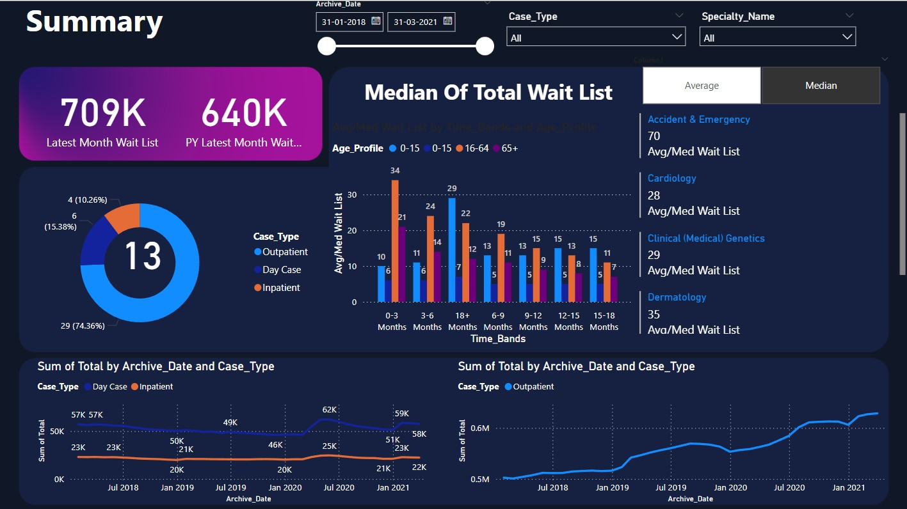
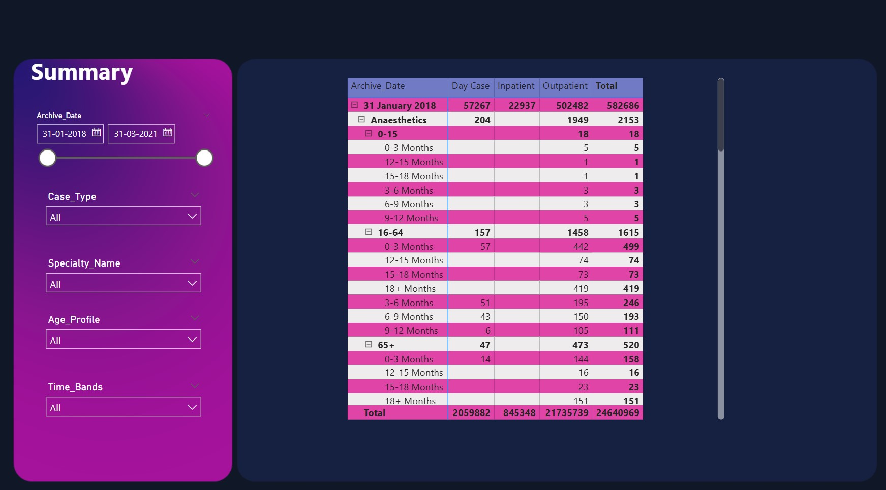

# End-to-End Power BI Dashboard Development for Patient Waiting List

## Overview

This project showcases the end-to-end process of developing a Power BI dashboard, using publicly available healthcare data focused on the Patient Waiting List. It covers everything from requirement gathering to data collection, transformation, modeling, visualization, and deployment, providing a comprehensive guide on creating meaningful insights for business stakeholders.

The goal is to track the current patient waiting list, analyze trends, and perform a detailed specialty-level and age-profile analysis. This dashboard is built with a high level of interactivity and visual appeal to meet the business objectives outlined by stakeholders.

## Key Features

- **Data Collection**: Importing data from various sources like CSV and Excel files.
- **Data Transformation**: Using Power Query to clean, merge, and structure the data.
- **Data Modeling**: Creating relationships between tables for efficient analysis.
- **Dynamic Visuals**: Leveraging DAX for dynamic titles, calculations, and interactive elements.
- **Interactivity**: Implementing navigation buttons and tooltips for a user-friendly experience.
- **Scheduled Refresh**: Setting up automated monthly data refresh for ongoing maintenance.

## Step-by-Step Process

### 1. Requirement Gathering

- **Stakeholder Identification**: Understanding who will be using the dashboard and gathering key objectives.
- **Business Objectives**: Defining clear goals to ensure the dashboard helps achieve the desired results.
- **Data Study**: Understanding the data’s structure, quality, and sources.
- **Scope Definition**: Identifying KPIs, metrics, and deployment timelines for the project.

### 2. Data Collection

- **Sources**: Data is collected from CSV and Excel files stored in a central folder.
- **Power BI Folder Connector**: Importing data into Power BI using the Folder connector to ensure a seamless refresh process.

### 3. Data Transformation & Modeling

- **Power Query Editor**: Renaming columns, rearranging, appending tables, and cleaning data (e.g., removing trailing blanks).
- **Data Modeling**: Creating relationships between the main data table and additional mapping tables.
- **Data Cleansing**: Handling missing or erroneous data to ensure the final dataset is ready for analysis.

### 4. Data Visualization Blueprint

Creating a visualization blueprint or wireframe to understand the layout and elements required for the dashboard.

### 5. Dashboard Layout & Design

---

- **Enabled key design properties** like Gridlines and Snap to Grid from the View tab to align and place visuals uniformly, ensuring a consistent and organized layout.
- **Created DAX measures** to calculate the **Latest Month** and **Previous Year Wait List**:
  - `Latest Month Wait List = CALCULATE(SUM(All_Data[Total]),All_Data[Archive_Date] = MAX(All_Data[Archive_Date])) + 0`
  - `PY Latest Month Wait List = CALCULATE(SUM(All_Data[Total]),All_Data[Archive_Date]= EDATE(MAX(All_Data[Archive_Date]),-12)) + 0`
- **Developed toggleable metrics** for Average vs. Median Wait Lists by creating a table with two rows (Average & Median) and using a slicer to allow users to switch between these calculations. This is powered by the DAX measures:
  - `Median Wait List = MEDIAN(All_Data[Total])`
  - `Average Wait List = AVERAGE(All_Data[Total])`
  - `Avg/Med Wait List = SWITCH(VALUES('Calculation Method'[Calc Method]),"Average",[Average Wait List],"Median",[Median Wait List])`
  - `Dynamic Title = SWITCH(VALUES('Calculation Method'[Calc Method]),"Average","Key Indicators - Patient Wait List (Average)","Median","Key Indicators - Patient Wait List (Median)")`
- **Implemented No-Data Alerts** to display contextual messages when there’s no data for selected filters using DAX:
  - `NoDataLeft = IF(ISBLANK(CALCULATE(SUM(All_Data[Total]),All_Data[Case_Type]<>"Outpatient")),"No data for selected criteria","")`
  - `NoDataRight = IF(ISBLANK(CALCULATE(SUM(All_Data[Total]),All_Data[Case_Type]="Outpatient")),"No data for selected criteria","")`
- **Designed a responsive Summary Page** with interactive charts such as:
  - Doughnut chart, clustered column chart, and multi-row card for top five metrics
  - Line chart showing Total Wait List by Archive_Date with filters for Case_Type, Archive_Date, and Specialty.
- **Created Detailed View** using matrix visualization with dimensions like Archive_Date, Specialty_Name, Age_Profile, Time_Bands, Case_Type, and Total.
- **Developed Tooltip Page** to provide additional insights when hovering over the line chart in the summary page, showing specialty and total waitlist details.
- **Enhanced the dashboard’s aesthetics** by drawing inspiration from external resources (Google, Adobe Stock), extracting color palettes from Color.Adobe.com, and designing a custom background using PowerPoint or Canva. The final design was used as a background in Power BI to improve the visual appeal.

